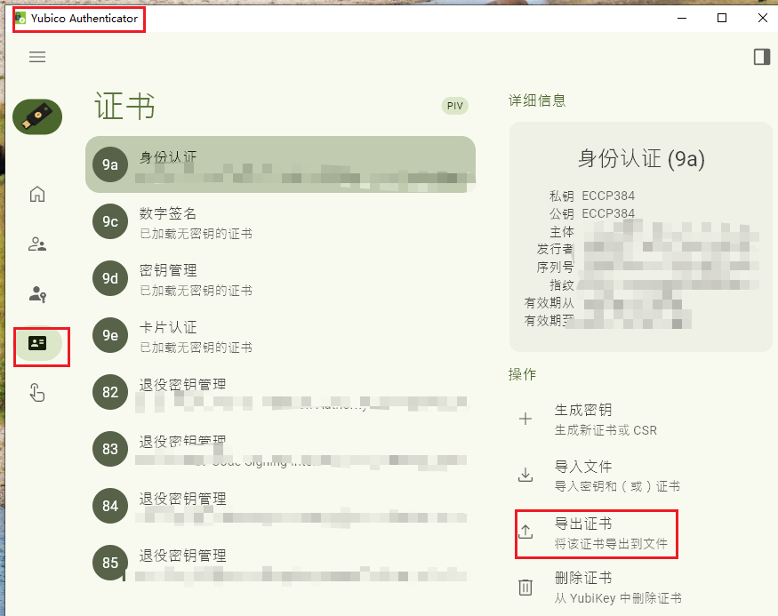
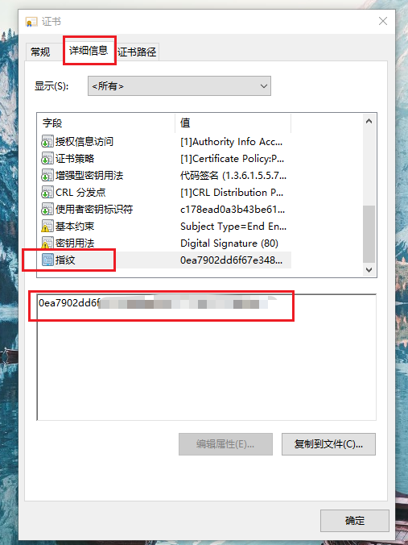
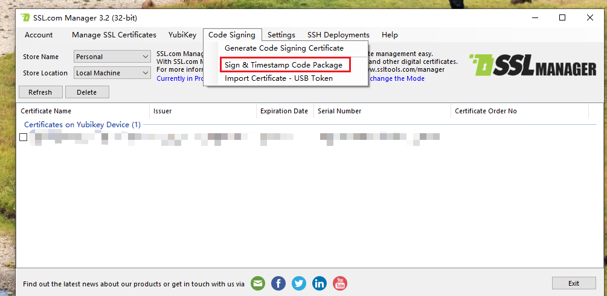

# yubikey_ev_server

yubikey ev 签名服务器

## 1. 有什么作用

众所周知，windows 驱动的ev签名，现在不提供证书文件了，而是提供存放在u盘里面。

一些比较阳间的提供商（如GlobalSign），给的是SafeNet eToken，配合SafeNet Authentication Client，非常便于jenkins ci/cd集成。

而一些阴间的提供商（如SSL），则提供了业界遥遥领先的YubiKey，搭配每次签名都要输入PIN码的验证，带了极致的安全性（就是马没了）。

本工具从SSL Manager中扣出了签名部分代码，提供http服务，签名时只需要第一次输入PIN码，便于与其他工具集成。

http get 访问 http://127.0.0.1:11451/sign?path=xxx&thumbprint=xxx&timestamp=xxx

一共三个参数，path 为需要签名的本地路径，thumbprint 为证书指纹，timestamp 为时间戳服务器。

timestamp 已知的可选值有以下4个。

http://timestamp.digicert.com

http://ts.ssl.com

http://timestamp.comodoca.com/authenticode

http://tsa.starfieldtech.com

## 2. 如何使用

### 2.1 安装环境

安装 YubiKey-Minidriver，YubiKey-Manager，Yubico-Authenticator。

### 2.2 获取证书指纹

打开Yubico-Authenticator，从证书页面导出证书。

双击打开详细信息，获取证书指纹。

把这个证书导入系统根证书，然后重启，系统就能识别到了。

## 3. 其他问题

如果一直签名失败，先下载个[SSL Manager](https://www.ssl.com/ssl-manager/)，试下哪里不对吧，比较代码从里面扣的。

